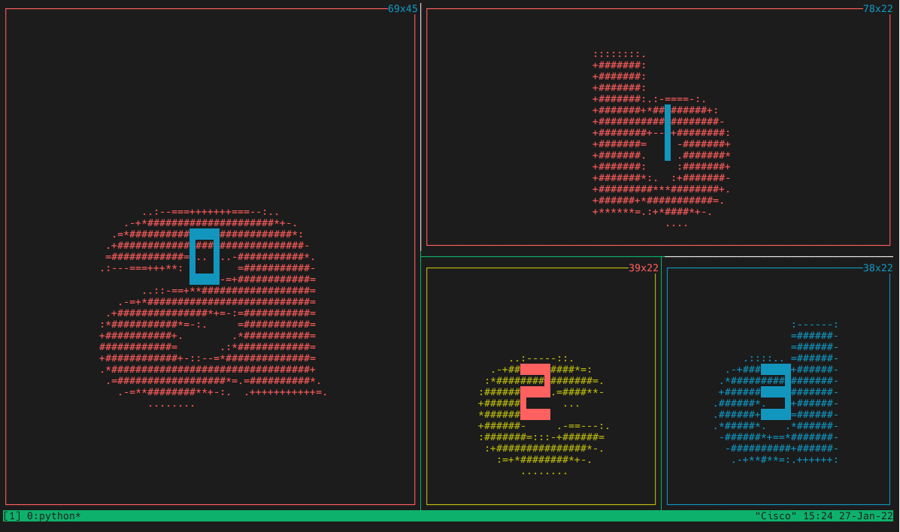

# indicator



`indicator` is a tiny script that shows a letter on full terminal screen. Noticed that the numbers, a.k.a pane numbers, showing on screen and the pane size on every pane's right-top corner are provided by `tmux` not this script. In this case, `indicator` only draws those colorful large latin letters and borders around them.

This script is initially built for demostration purpose, if you find it useful in some case, please let me know.

## Usage

```shell
$ indicator [--letters letter-to-show] [--fore-color color] [--back-color color] [--font-size number]
```

colors to choice from including:

```
black blue cyan green magenta red white yellow default
```

## Acknowledgement

This script is heavily adapted from Mahesh Venkitachalam's ASCII.py script. The usage of `termios.TIOCGWINSZ` comes from [egmont](https://stackoverflow.com/a/43947507).